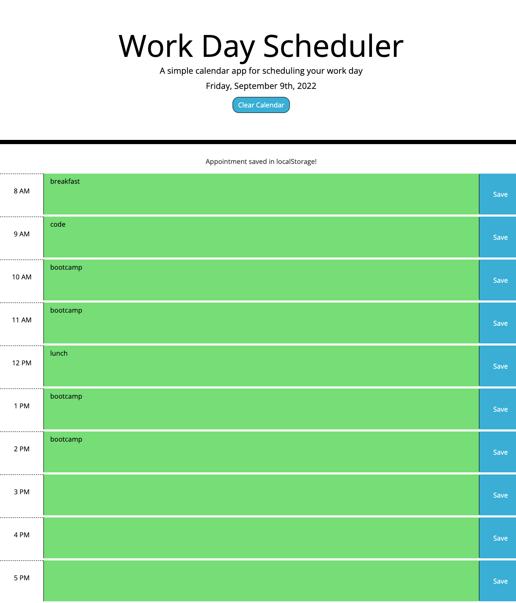

# Work-Day-Scheduler

Module 5 assignment for UCSD Full Stack Bootcamp

This tool allows the user to plan out their work day hour by hour. The user can enter plans/events for each hour that is displayed (starting from 8AM and ending at 5PM) and save this data using the "Save" button, which will be stored in localStorage and can be recalled as needed. As an added functionality, the "Clear Calendar" button at the top bar will clear the scheduler as well as the localStorage stored values.

Link to the site: https://jsp220.github.io/Work-Day-Scheduler/

